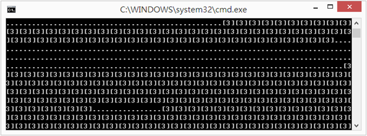
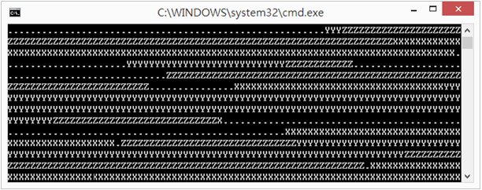
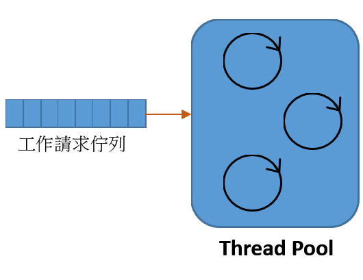

# Chapter 2: .NET 非同步 API 概覽

如前一章提到的，直接操控執行緒並不是非同步程式設計的唯一方法，也不是最佳方法。打從 .NET 1.x 開始就已經提供非同步 API，此後持續演進，在底層框架、模式、和語法方面都有逐步改進，並衍生出新的 API。本章會簡單介紹現代 .NET 非同步程式設計的模式和觀念，包括直接建立執行緒（又稱為「建立專屬執行緒」）、執行緒集區（thread pool）、以及目前優先建議使用的 **TAP（Task-based Asynchronous Pattern）** 和 C# 為了支援 **TAP** 所增加的 `async` 和 `await` 關鍵字的用法。

在剛才提到的幾種非同步 API 寫法當中，專屬執行緒（2.1 節）在本章占有較大比重，而其他 API 只是概略性的粗淺介紹。這是因為，執行緒（thread）依然是非同步程式設計的基本概念之一，了解其用法亦有助於學習其他非同步 API。如果您希望盡快了解 TAP 和 C# 的 async/await 寫法，亦可跳過本章，直接進入下一章。

---

> 本章範例程式的原始碼位置：
> <https://github.com/huanlin/async-book-support> 裡面的 Examples/ch02 資料夾。

## 專屬執行緒

上一章提過，建立執行緒會產生一些額外負擔，包括作業系統的核心物件、堆疊空間、context switch 等等。儘管如此，它在某些場合仍有用處，特別是需要長時間執行的背景工作（本章稍後會進一步說明專屬執行緒的使用時機）。

為了與其他非同步程式設計模型有所區別，本書採用 Jeffrey Richter 在《CLR via C# 4th Edition》中的用詞「專屬執行緒」（dedicated thread）來指稱這種直接建立一條執行緒來專門執行特定工作的作法。

在 .NET 中，用來操控專屬執行緒的類別是 `System.Threading.Thread`。也就是說，.NET 的 `Thread` 類別封裝了作業系統底層的執行緒。我們知道 .NET 程式碼又稱為 managed code（受管理的程式碼），所以 .NET 環境中的執行緒也稱之為 **managed thread**（受管理的執行緒）。

這裡一併介紹個名詞：**主執行緒**（main thread）。

每個應用程式運行時都是有一條預設的執行緒，稱為「主執行緒」（**main thread**）。對於桌面應用程式來說，主執行緒通常也是負責處理使用者介面的執行緒，故有時也說「**UI 執行緒**」（UI thread）。

接著就來看 `Thread` 類別的一些基本用法。

### 建立與啟動執行緒

底下是個測試多執行緒的簡單範例，示範如何建立一條執行緒來執行某件非同步工作。

```csharp
using System;
using System.Threading;

class Program
{
    static void Main(string[] args)
    {
        Thread t1 = new Thread(MyTask);
        t1.Start();

        for (int i = 0; i < 500; i++)
        {
            Console.Write(".");
        }
    }

    static void MyTask()
    {
        for (int i = 0; i < 500; i++)
        {
            Console.Write("[" + Thread.CurrentThread.ManagedThreadId + "]");
        }
    }
}
```

> 此範例程式的專案名稱：Ex01_ThreadStart.csproj。

程式說明：

- 使用 `System.Threading.Thread` 類別來建立執行緒物件，同時將一個委派方法 `MyTask` 傳入建構函式。這個委派方法將於該執行緒開始運行時被自動呼叫。
- 呼叫執行緒物件的 `Start` 方法，令執行緒開始運行，亦即在這個工作執行緒中呼叫 `MyTask` 方法。
- `Main` 函式開始一個迴圈，持續輸出「.」。這只是為了識別哪些文字是由主執行緒輸出，哪些是由工作執行緒輸出。
- `MyTask` 函式也有一個迴圈，持續輸出目前執行緒的編號。

下圖為此範例程式的執行結果：



從輸出結果可以看得出來，主執行緒跑了一段時間，切換至我們另外建立的工作執行緒。工作執行緒也同樣跑了一段時間之後，又切回主執行緒，如此反覆切換，直到兩個執行緒的迴圈結束為止。

建立 `Thread` 物件時，傳入建構函式的委派有兩種版本。一種是 `ThreadStart`，另一種是 `ParameterizedThreadStart`。以下是這兩種委派型別的宣告：

```cs
public delegate void ThreadStart();
public delegate void ParameterizedThreadStart(Object obj);
```

前述範例使用的是第一種，也就是不需要傳入參數的 `ThreadStart` 委派型別。如果在啟動工作執行緒時需要額外傳入一些資料，就可以使用第二種委派型別：`ParameterizedThreadStart`。參考以下範例：

```cs
using System;
using System.Threading;

class Program
{
    static void Main(string[] args)
    {
        Thread t1 = new Thread(MyTask);
        Thread t2 = new Thread(MyTask);
        Thread t3 = new Thread(MyTask);

        t1.Start("X");
        t2.Start("Y");
        t3.Start("Z");

        for (int i = 0; i < 500; i++)
        {
            Console.Write(".");
        }
    }

    static void MyTask(object param)
    {
        for (int i = 0; i < 500; i++)
        {
            Console.Write(param);
        }
    }
}
```

{icon=file-code-o}
G> #### 此範例程式的專案名稱：Ex02_ParamThreadStart.csproj。

程式說明：

- 首先建立三個執行緒物件，而且這三個執行緒都會執行同一項任務：`MyTask`。
- `MyTask` 方法需要傳入一個 `object` 型別的參數，而此參數的值是在啟動執行緒時傳入。在啟動三個執行緒物件時，我分別傳入了 “X”、”Y”、”Z”，以便從輸出結果中觀察各執行緒輪流切換的情形。

執行結果：



### 等待與暫停執行緒

`Thread` 類別有個 `IsAlive` 屬性，代表執行緒是否正在運行。一旦呼叫執行緒物件的 `Start` 方法令它開始執行，其 `IsAlive` 屬性值就會等於 `true`，直到該執行緒的委派方法執行完畢，那條執行緒便隨之結束。因此，如果想要等待某執行緒的工作執行完畢才繼續處理其他工作，用一個迴圈來持續判斷執行緒物件的 `IsAlive` 屬性就能辦到。

還有一個更簡單的作法可以等待執行緒結束：呼叫 `Thread` 物件的 `Join` 方法。參考以下範例：

```cs
using System;
using System.Threading;

namespace Ex03_ThreadJoin
{
    class Program
    {
        static void Main(string[] args)
        {
            Thread t1 = new Thread(MyTask);
            Thread t2 = new Thread(MyTask);
            Thread t3 = new Thread(MyTask);

            t1.Start("T1");
            t2.Start("T2");
            t3.Start("T3");

            t1.Join();
            t2.Join();
            t3.Join();

            Console.ReadKey();
        }

        static void MyTask(object param)
        {
            Console.WriteLine("{0} 已開始執行 MyTask()", param);
            Thread.Sleep(3000);    // 令目前這條執行緒暫停三秒。
            Console.WriteLine("{0} 即將完成工作", param);
        }
    }
}
```

> #### 此範例程式的專案名稱：Ex03_ThreadJoin.csproj

說明：

- 在 `Main` 函式中，先起始三條執行緒，然後逐一呼叫它們的 `Join` 方法——這會令主執行緒依序等待 `t1`、`t2`、`t3` 執行完畢之後才繼續執行底下的程式碼。
- 此範例還用到了 `Thread.Sleep` 方法。此方法會令目前所在的執行緒休息一段指定的時間，時間單位是毫秒（millisecond）。`Thread.Sleep` 方法也常被用來模擬應用程式正在忙著處理某件工作而暫時無法回應其他請求。

執行結果如下圖：


### 共享變數

理想情況下，各執行緒分頭進行，互不干涉，程式碼寫起來比較單純。但實務上，執行緒之間卻經常需要存取共享的資源或變數，這就產生了一些麻煩。

{width=85%}


更明確地說，多條執行緒之間共享同一個變數時，如果都只是讀取變數值，並不至於有太大的問題。然而，如果有多條執行緒會去修改共享變數的值，那就得運用一些技巧來避免數值錯亂的情形。看看底下這個範例：

```cs
class Program
{

    static void Main(string[] args)
    {
        new SharedStateDemo().Run();
        Console.ReadLine();
    }
}

public class SharedStateDemo
{
    private int itemCount = 0;   // 已加入購物車的商品數量。

    public void Run()
    {
        var t1 = new Thread(AddToCart);
        var t2 = new Thread(AddToCart);

        t1.Start(300);
        t2.Start(100);
    }

    private void AddToCart(object simulateDelay)
    {
        itemCount++;

        /*
         * 用 Thread.Sleep 來模擬這項工作所花的時間，時間長短
         * 由呼叫端傳入的 simulateDelay 參數指定，以便藉由改變
         * 此參數來觀察共享變數值的變化。
         */
        Thread.Sleep((int)simulateDelay);
        Console.WriteLine("Items in cart: {0}", itemCount);
    }
}
```

> 此範例程式的專案名稱：Ex04_SharedState.csproj。

程式說明：

- `Main` 函式會建立 `SharedStateDemo` 物件並呼叫其 `Run` 方法。此範例的重點在 `SharedStateDemo` 類別裡面，示範的情境為購物車。
- `SharedStateDemo` 類別有一個整數欄位：`itemCount`，代表已加入購物車的商品數量。此變數將作為執行緒之間共享的變數。
- `SharedStateDemo` 類別的 `Run` 方法會建立兩條執行緒，它們的工作都是呼叫 `AddCart` 方法，代表「加入購物車」的動作。
- `AddCart` 方法需要傳入一個參數，用來模擬每一次加入購物車的動作需要花多少時間。從 `Run` 方法的程式碼可以看得出來，我刻意讓第一條執行緒花比較多時間（延遲 300 毫秒）。

執行結果：


如果 `t1` 和 `t2` 這兩條執行緒是依照它們啟動的順序先後完成任務，執行結果的第一列所顯示的購物車商品數量應為 1，第二列的數量才是 2。可是現在卻全都是 2，這是因為 `t1` 先啟動，進入 `AddCart` 函式之後，把 `itemCount` 加一，然後進入一段模擬長時間工作的延遲（300ms）。由於此時 `t2` 已經啟動了，也把 `itemCount` 加一了（其值為 2），然後也進入一段延遲（100ms）。但由於 `t2` 的延遲時間較短，比 `t1` 更快執行完畢（後發而先至），因此執行結果畫面中的第一列文字其實是由執行緒 `t2` 輸出的。接下來，`t1` 也跑完了，但此時的 `itemCount` 已經被 `t2` 改成了 2，所以輸出的結果自然就一樣了。

> 在我的機器上，即使呼叫 `t1.Start(`) 時傳入 1（僅延遲 1 毫秒），輸出結果仍舊相同，並不因為 `t1` 的模擬延遲時間縮短成 1 毫秒而產生先 1 後 2 的結果。我想這是因為我的機器有多核心 CPU，於是 `t1` 才剛啟動，將 `itemCount` 遞增為 1，此時 `t2` 其實也已經（由另一個 CPU 核心）啟動了，`itemCount` 便遞增為 2。
>
> 不過，如果改成 `t1.Start(0)`，亦即令 t1 模擬延遲的時間為 0 毫秒，執行結果可能就會變成先 1 後 2 了（不見得每一次執行結果都一樣，視機器而定）。這是因為 `Thread.Sleep(0)` 完全沒有延遲的作用，故來得及在其他執行緒進入該程式區塊之前完成工作。

有時候，這種多條執行緒共同修改一個變數的情況可能會導致嚴重問題。比如說，當應用程式正在計算某員工的薪資，才處理到一半，還沒算完呢，又有其他執行緒修改了共享的薪資計算參數，可能原本的計算結果應該是 63,000，結果卻成了 59,000。

接著就來看看如何解決這個問題，讓此範例的執行結果顯示的商品數量變成先 1 後 2，而不是兩次都輸出 2。

### 執行緒同步化

剛才展示的多執行緒修改同一變數所衍生之變數值錯亂的問題，有點像是很多人同時伸手搶——很容易把餅給抓爛了。解決方法說來簡單，就是排隊。也就是說，原本以非同步執行的各條執行緒，碰到了要修改共享變數的時候，都要乖乖排隊，一個做完了才換下一個。這等於是暫時切換成同步執行的方式，如同在八線道的公路某處設下關卡，將道路限縮成單線道，只許一輛汽車通行；等車輛駛出關卡，前方又恢復成多線道，任憑奔馳。

這種迫使多條執行緒從非同步暫時切換成同步執行的技巧，叫做**執行緒同步化（thread synchronization）**。

#### 鎖定

執行緒同步化的技巧有很多種，這裡要示範的是以 C# 的 `lock` 陳述式來建立獨佔鎖定（exclusive lock）的程式區塊，迫使各執行緒在進入特定程式碼區塊時乖乖排隊，以達到同步化的效果。也就是說，`lock` 可以把某程式碼區塊——而不是整個函式或整個類別——變成同時間只允許一個執行緒進入的「單線道」。

> 使用獨佔鎖定的技巧時，要注意避免兩條執行緒互相等待對方釋放鎖定而導致鎖死（deadlock）的情形。

只要稍微修改上一個範例的 `SharedStateDemo` 類別，輸出結果就會不同。底下是修改後的程式碼：

```cs
public class SharedStateDemo
{
    private int itemCount = 0;
    private object locker = new Object(); // 用於獨佔鎖定的物件

    public void Run()
    {
        var t1 = new Thread(AddToCart);
        var t2 = new Thread(AddToCart);

        t1.Start(300);
        t2.Start(100);
    }

    private void AddToCart(object simulateDelay)
    {
        Console.WriteLine("Enter thread {0}", // 顯示目前所在的執行緒編號
            Thread.CurrentThread.ManagedThreadId);
        lock (locker)  // 讓底下這個程式區塊變成同時間只允許一條執行緒進入。
        {
            itemCount++;

            Thread.Sleep((int)simulateDelay);
            Console.WriteLine("Items in cart: {0} on thread {1}",
                itemCount, Thread.CurrentThread.ManagedThreadId);
        }
    }
}
```

> 此範例程式的專案名稱：Ex05_Lock.csproj。

程式說明：

- 類別中多了一個型別為 `Object` 的私有成員：`locker`。此物件是用來作為獨佔鎖定之用，可以是任何參考型別，但不能是實質型別（value type）。若把實質型別的物件傳入 `lock` 敘述，在程式編譯階段就會出錯。

- `AddCart` 函式中增加了 `lock` 陳述式。當兩條執行緒同時爭搶同一個鎖定物件時，其中一條執行緒會被擋住，等到被鎖定的物件被先前搶到的執行緒釋放了，才能夠取得鎖定。如此便能夠確保以 `lock` 關鍵字包住的程式區塊在同一時間內只會有一條執行緒進入。

這次除了增加獨佔鎖定的程式敘述，還把執行緒編號也一併秀出來，方便確認。執行結果如下圖：


你可以看到，執行緒編號 3 和 4 都已分別啟動了，但是購物車的數量會依兩條執行緒的順序各自遞增一次，並顯示正確的結果。像這種有加上保護機制來避免多執行緒爭搶共用變數而致資料錯亂的程式寫法，我們說它是**「執行緒安全的」（thread-safe）**。如果你看到某些元件或類別庫宣稱它們是「執行緒安全的」，那就表示它們在設計時便已經考慮到多執行緒的應用場合。

說到「執行緒安全」，這裡順便提一下，.NET 提供的泛型集合類別，包括  `Dictionary<TKey, TValue>`、`List<T>`、`Queue<T>`、`Stack<T>`、`SortedDictionary<TKey, TValue>`、`HashSet<T>`、`SortedSet<T>` 等等，它們都可以讓多條執行緒並行讀取集合內容，可是如果你在程式中修改上述任一種集合的內容，你就必須確保在修改集合的當下，不會有其他執行緒也正好要修改或讀取那個集合的內容。如果你需要更強固的執行緒安全性，則可以考慮使用 .NET 提供的另一組「並行的」或「不可變的」集合類別，例如 `ConcurrentDictionary<TKey,TValue>`、`ImmutableDictionary<TKey,TValue>`。當然，寫程式的時候，若沒把握，最好還是查一下官方文件，以了解這些類別在多執行緒應用程式當中使用時的依些注意事項。

> 「並行的」集合類別是放在命名空間 `System.Collections.Concurrent` 裡；「不可變的」集合類別則是放在命名空間 `System.Collections.Immutable` 裡。

對了，你可能在某些地方看到過 `lock (this)` 的寫法。這種寫法雖然不用多宣告一個私有欄位（如前例的 `locker`），但是在某些比較複雜的場合可能會導致效能不佳甚至鎖死（deadlock）的情形。原因在於， `this` 是「此物件」本身，而應用程式可在任何地方存取「此物件」並且同樣使用 `lock` 來把它「上鎖」，以至於出現多條執行緒都在等待物件解鎖的情形，導致程式鎖死。相對的，如果 `lock` 上鎖的對象是類別的私有欄位，那麼除此類別之外，再沒別的地方能夠存取私有欄位，便可確保不受其他程式碼的影響。

> 官方 C# 參考手冊也明確建議，餵給 `lock` 陳述式的物件應該是專門用來上鎖的物件，而且要避免使用 `this`。如有興趣進一步了解，可上網搜尋：「Why is lock(this) {…} bad?」

> 其他同步化技巧
>
> 剛才介紹的 `lock` 敘述，其實背後使用的是 `System.Threading.Monitor` 類別。如果你需要了解其他同步化技巧，可上網搜尋以下類別的說明文件和範例：
>
> - `Mutex`
> - `SemaphoreSlim`
> - `AutoResetEvent`
> - `ManualResetEventSlim`
> - `CountDownEvent`
> - `Barrier`
> - `ReaderWriterLockSlim`
> - `SpinWait`
>
> 請注意上列以「Slim」結尾的類別，在 .NET Framework 裡面還有提供非「Slim」結尾的類別，例如 `ReaderWriterLock`。這些名稱以 「Slim」結尾的是比較新的類別，除了更輕量，也更少發生鎖死（deadlock）的情況，故效能通常也比非 "Slim" 結尾的舊版類別更好。

### 前景執行緒 vs. 背景執行緒

在 .NET 應用程式中的執行緒可進一步區分為「前景執行緒」和「背景執行緒」。兩者的主要區別是：當某個應用程式中所有的前景執行緒都停止時，CLR 會停止該應用程式的所有背景執行緒（而且不會拋出任何異常），並結束應用程式。若只是停止背景執行緒，則不會造成應用程式結束。因此，我們通常會把那些一定要執行完畢的工作交給前景執行緒，而將比較不重要的、或者可以隨時中斷再接續進行的工作交給背景執行緒來處理。

預設情況下，新建立的執行緒皆為前景執行緒，但你可以透過 `Thread` 物件的 `IsBackground` 屬性來將它改成背景執行緒。參考以下範例：

```cs
class Program
{
    static void Main(string[] args)
    {
        Thread t = new Thread(MyTask);
        t.IsBackground = true;
        t.Start();

        // 若 t 是前景執行緒，此應用程式不會結束，除非手動將它關閉;
        // 若 t 是背景執行緒，此應用程式會立刻結束。
    }

    static void MyTask()
    {
        while (true)
            ;
    }
}
```

> 此範例程式的專案名稱：Ex06_BackgroundThread.csproj。

程式說明：

- 此範例程式在 `Main` 函式中建立一條新的執行緒之後，將它設定為背景執行緒，並令它開始執行。
- 接著 `Main` 就結束了，這表示前景執行緒結束了。因此就算 `MyTask` 函式仍在跑無窮迴圈，應用程式仍會立刻結束。若把 t 設定為前景執行緒（預設值），則 `Main` 函式結束之後，應用程式並不會結束，除非手動將它關閉。

### 何時使用 Thread？

現代 .NET 開發中，`System.Threading.Thread` 的使用率已大幅降低，大多數情境都被 `Task` 和 async/await 取代。但在某些特殊情境下，建立專屬執行的做法仍然有用武之地：

- 使用前景（foreground）執行緒來執行長時間運行的任務。
  - `Task` 預設使用背景執行緒，當應用程式結束時，它可能會被強制終止。執行緒集區（於下一節介紹）裡面的執行緒永遠都是背景執行緒，它們有可能還沒完成任務就被 .NET CLR (Common Language Runtime) 結束掉。
  - `Thread` 預設是前景執行緒，即使主程式結束，它仍然會繼續執行。
- 需要精確控制執行緒的行為時。例如：
  - 你希望某些執行緒擁有特殊優先權（若無正當理由，不建議這麼做）。預設情況下，執行緒的優先權是「正常」等級。如果想要讓某執行緒擁有特權，則可以個別建立執行緒並修改其優先權。
  - 執行緒開始工作後，你可能需要在某些情況下提前終止執行緒（透過呼叫 `Thread` 類別的 `Abort` 方法）。

## 執行緒集區

如第 1 章提過的，建立執行緒需要付出額外成本，而頻繁地建立與摧毀執行緒，則是一種沒效率的資源運用方式，甚至可能拖垮應用程式的效能。因此，.NET CLR 實作了集區（pool）的概念，讓應用程式可將已完成任務的執行緒丟進集區裡面待命，等到有其他工作需要以非同步方式執行，便可透過集區中閒置的執行緒來負責執行工作。簡單地說，執行緒集區就是一種重複使用執行緒的機制。

%%正如同其他類型的集區（例如資料庫連線集區），其主要目的都是要降低因為頻繁建立與釋放資源所產生的效能損耗。另一方面，由於執行緒集區是由底層系統來管理，系統便能針對整體執行環境的狀況來優化相關參數（例如每條執行緒要分配多少執行時間），讓開發人員能夠更專注在應用程式的邏輯，不用擔心底層的瑣碎細節。

### 執行緒集區的運作方式

一般而言，每一個執行中的 .NET 應用程式都有一個、而且只有一個執行緒集區。

> 引述 Jeffrey Richter 在《CLR via C#》中的說法供讀者參考：「每一個 CLR 有一個執行緒集區，而且那個 CLR 管理的所有 App Domains 都會共享這個執行緒集區。如果一個應用程式會同時載入多個 CLR，則每一個 CLR 都有它自己的執行緒集區。」

執行緒集區內部有一個工作請求佇列，每當應用程式需要非同步操作時，便可呼叫特定 API 來將工作請求送進這個佇列。CLR 會從佇列中逐一取出請求（先到先服務），並查看集區裡面有沒有閒置的執行緒。由於 CLR 初始化時，其執行緒集區是空的，於是 CLR 會建立一條新的執行緒來負責執行任務。等到任務執行完畢，CLR 並不摧毀那個執行緒，而是將它放回執行緒集區休息，等待下一次任務指派。如此一來，就如前面所說，執行緒能夠重複使用，從而減少了反覆建立和摧毀執行緒所產生的效能損耗。下圖簡略描繪了執行緒集區的運作方式。



另一方面，集區中的執行緒在閒置一段時間之後若未再接到新任務，就會自動摧毀，以便將記憶體資源釋放出來。除了摧毀閒置的執行緒，CLR 還有一套演算法，會根據系統目前擁有的運算資源（CPU 核心的數量）和應用程式的負載等狀況來決定是否要建立更多執行緒來處理應用程式提出的工作請求。比如說，當 CLR 發現目前工作佇列中排隊等待的工作迅速增加，以至於集區中的執行緒數量來不及消化時，便會依內定的演算法來決定是否要增加新的執行緒到集區裡面。

> 執行緒集區的大小限制
>
> 執行緒集區的預設大小取決於多種因素，並沒有一個固定的數值。如果你需要在程式中控制執行緒集區的大小，可以使用 [`ThreadPool.GetMaxThreads`](https://learn.microsoft.com/en-us/dotnet/api/system.threading.threadpool.getmaxthreads) 和 [`ThreadPool.SetMaxThreads`](https://learn.microsoft.com/en-us/dotnet/api/system.threading.threadpool.setmaxthreads) 方法。

### 工作執行緒與 I/O 執行緒

由 CLR 管理的執行緒集區有兩種：工作執行緒集區（**worker thread pool**）和輸入／輸出執行緒集區（**I/O thread pool**）。工作執行緒集區負責執行與 CPU 運算有關的工作，I/O 執行緒則專用來處理 I/O 操作（例如讀寫檔案、網路傳輸、資料庫處理等等）。其實這兩種集區裡面的執行緒都是同樣的東西，兩種集區在實作上採用了不同的演算法，以便更有效率地運用系統資源，並提升執行效能。

> Windows 如何處理 I/O 操作
>
> 舉例來說，假設你的應用程式使用了 `File.ReadAllText()` 方法來讀取檔案內容；請注意這是個同步的（synchronous）方法。當應用程式執行到這個方法時，Windows 作業系統核心會起始一個檔案 I/O 操作，而當此 I/O 操作正在執行時，應用程式目前的執行緒便沒事可做，只能等待那個 I/O 操作完成，因此，Windows 會先讓那條執行緒進入休眠狀態，以免它閒閒沒事卻占用 CPU 時間。這樣雖然節省了時間（讓 CPU 把時間分配給其他執行緒），可是卻沒有節省到空間——執行緒雖然暫時休眠，但它仍然占著記憶體空間。此外，如果是 UI 類型的應用程式（例如 Windows Forms），主執行緒在休眠期間完全無法回應使用者的操作，使用者也就只能等待。
>
> 現在假設你改用 `StreamReader.ReadAsync()` 方法，以非同步 I/O 的方式讀取檔案。當應用程式執行到這個方法時，當前的執行緒並不會進入休眠，而是立刻返回，並且繼續執行其他程式碼。如此一來，便改善了剛才提到的缺點。那麼，應用程式如何取得結果呢？非同步方法 `ReadAsync` 會傳回一個 `Task<int>`，你可以用這個物件來取得該方法的執行結果。關於 `Task` 類別的用法，本書後面還會進一步介紹。

大致了解執行緒集區的運作方式與相關概念之後，接著就來看看程式的寫法。

### 使用執行緒集區

欲利用集區中的執行緒來執行特定工作——這裡專指牽涉 CPU 運算的工作（compute-bound tasks）——可以用 .NET 的 `ThreadPool` 類別的靜態方法：`QueueUserWorkItem`。其實從方法的名稱也可以看得出來，此方法所使用的集區是工作執行緒集區，而不是 I/O 執行緒集區。

`QueueUserWorkItem` 方法有兩種版本：

```cs
static Boolean QueueUserWorkItem(WaitCallback callBack);
static Boolean QueueUserWorkItem(WaitCallback callBack, Object state);
```

呼叫此方法時，它會將你指定的「工作項目」（work item）加入執行緒集區的工作請求佇列，然後立即返回呼叫端。所謂的工作項目，也就是輸入參數 `callBack` 所代表的回呼函式，此函式的宣告（回傳值與參數列）必須符合 `System.Threading.WaitCallback` 委派型別，如下所示：

```cs
delegate void WaitCallback(Object state);
```

當 CLR 從執行緒集區中取出一條執行緒來執行佇列中的任務時，就會呼叫那個預先指定的回呼函式。如需提供額外參數給回呼函式，在呼叫 `QueueUserWorkItem` 時可透過參數 `state` 來傳遞。

底下是個簡單範例：

```cs
class Program
{
    static void Main(string[] args)
    {
        ThreadPool.QueueUserWorkItem(MyTask);

        for (int i = 0; i < 500; i++)
        {
            Console.Write(".");
        }
    }

    static void MyTask(object state)
    {
        for (int i = 0; i < 500; i++)
        {
            Console.Write("[" + Thread.CurrentThread.ManagedThreadId + "]");
        }
    }
}
```

> 此範例程式的專案名稱：Ex07_ThreadPool.csproj。

備註：雖然 `ThreadPool` 類別有提供 `SetMinThreads` 和 `SetMaxThreads` 方法來改變集區大小的下限與上限，但是最好還是別任意使用，因為更改集區大小的預設值往往只會讓效能更糟——除非你非常清楚目前使用的 CLR 版本所實作的執行緒集區的內部運作細節。

除了 `ThreadPool.QueueUserWorkItem()` 之外，另外還有一種作法也是透過執行緒集區來執行非同步工作：`System.Threading.Timer`（適用於定期執行特定背景工作的場合）。

## 基於 Task 的非同步模式（TAP）

**TAP** 是 Task-based Asynchronous Pattern 的縮寫，亦即「基於工作（任務）的非同步模式」。

> 在討論 task 時，我會交替使用幾個意思相近的名詞，包括：工作、任務，操作、或作業。例如：非同步工作。

### 工作平行程式庫（TPL）

TAP 這個非同步模式需要倚賴 .NET 提供的一組 API，即 **Task Parallel Library**（工作平行程式庫），簡稱 **TPL**。這組 API 的相關類別是放在 `System.Threading` 和 `System.Threading.Tasks` 命名空間裡。

進一步說，TAP 的基礎是 `System.Threading.Tasks` 命名空間裡面的 `Task` 和 `Task<TResult>` 類別。這兩個類別都是用來代表非同步工作——`Task<TResult>` 繼承自 `Task`，可用於需要取得非同步工作之執行結果的場合；而 `Task` 是用在無需返回工作結果的場合。

可以這麼說：TPL 的設計理念是要把「非同步工作」這個抽象概念統一用 `Task`（以及它的兄弟姊妹，如 `ValueTask`）類別來表示，並且提供一組相應的 API 來輔助。每一個 `Task` 物件即封裝了一項非同步執行的工作。這很像是委派（delegate）的概念——委派不也封裝了一項任務嗎？兩者的差別在於，委派是以同步的（synchronous）方式執行，而 `Task` 是以非同步的方式來執行其封裝的工作。

#### TPL 如何執行工作？

一個由 `Task` 所代表的非同步工作是由「**工作排程器**」（task scheduler）來安排執行時機。說得更精確些，所有需要動用執行緒的工作（thread-based tasks）都是由工作排程器來執行，而且多數情況下，我們都是使用 TPL 提供的預設工作排程器。

工作排程器的各項功能是定義於抽象類別 `TaskScheduler`，而且實作類別不只一種。在某些比較特殊的場合，如果預設排程器部無法滿足你的需要，你也可以改用特定類型的工作排程器，甚至自己寫一個。

預設的工作排程器是以執行緒集區（thread pool）為基礎——意思是，當你利用 TPL 來建立非同步工作（稍後就會看到範例），預設情況下，工作排程器會從執行緒集區提取一個工作執行緒（worker thread）來執行工作。.NET 執行緒集區會負責判斷如何分配執行緒以便獲得更高的執行效能，以及是否要創建一個新的執行緒、或是重複使用已經結束工作、處於閒置狀態的執行緒。

### 建立與起始非同步工作

底下這個範例程式與本章第一個範例程式（Ex01_ThreadStart.csproj）幾乎一樣，差別只在於把 `Thread` 類別換成了 `Task`。

```cs
static void Main()
{
    var task = new Task(MyTask);
    task.Start();

    for (int i = 0; i < 500; i++)
    {
        Console.Write(".");
    }
}

static void MyTask()
{
    for (int i = 0; i < 500; i++)
    {
        Console.Write("[" + Thread.CurrentThread.ManagedThreadId + "]");
    }
}
```

> 此範例程式的專案名稱：Ex10_Task.csproj。

程式說明：

- 使用 `System.Threading.Task` 類別來建立非同步工作，同時將一個符合 `Action` 委派的方法 `MyTask` 傳入建構函式。這個委派方法將於非同步工作開始執行時被自動呼叫。
- 呼叫 `Task` 物件的 `Start` 方法，以開始執行非同步工作。
- `Main` 函式開始一個迴圈，持續輸出「.」。這只是為了識別哪些文字是由主執行緒輸出，哪些是由工作執行緒輸出。
- `MyTask` 函式也有一個迴圈，持續輸出目前這個工作執行緒的編號。

下圖為此範例程式的執行結果：


前面提過，這裡簡短重複一次：預設的工作排程器會使用執行緒集區。換言之，當你使用 `Task` 類別來建立非同步工作時，就要意識到，這當中是有動用執行緒的。（第 3 章介紹的 `async`/`await` 寫法則不見得會動用執行緒）。

從範例程式的輸出結果也可以看得出來，主執行緒跑了一段時間，切換至我們另外建立的工作執行緒。工作執行緒也同樣跑了一段時間之後，又切回主執行緒，如此反覆切換，直到主執行緒結束為止。

> 預設情況下，執行緒集區裡面的執行緒都是「背景執行緒」，故此範例執行時，背景工作 `MyTask` 可能還沒跑完，便因為主執行緒的結束而隨之結束。

順便一提，如果要等待某個非同步工作執行完畢，可呼叫 `Task` 類別的 `Wait` 方法。你可以試試上述範例程式的 `task.Start();` 之後緊接著加入一行 `task.Wait();` 看看執行結果有何不同。

>你「可以」使用 `Task` 的 `Wait` 或其他方法來等待非同步工作的結果，但這不是建議作法，也不代表你可以隨意使用。事實上，除非必要，否則應該儘量避免使用這類會令非同步工作流阻塞的 API。

剛才的範例是先建立一個 `Task` 物件，然後等到需要開始執行非同步工作時才呼叫該物件的 `Start` 方法來啟動工作。如果建立和起始非同步工作的操作不需要分開進行，那麼你也可以使用 `Task` 類別的靜態方法 `Run`。參考以下範例（Ex10_TaskRun.csproj）：

```cs
static void Main()
{
    Task task = Task.Run(() =>
        {
            for (int i = 0; i < 500; i++)
            {
                Console.Write("[" + Thread.CurrentThread.ManagedThreadId + "]");
            }
        });

    for (int i = 0; i < 500; i++)
    {
        Console.Write(".");
    }

    task.Wait(); // 確保非同步工作執行完畢之後才往下繼續執行。
}
```

這裡使用了 `Task.Run()` 來建立並起始一個非同步工作，並且使用 lambda 表示式來撰寫委派方法。另外還在應用程式結束之前呼叫 `Task` 物件的 `Wait` 方法來等待非同步工作執行完畢。

> .NET Framework 4.5 開始提供 `Task.Run()` 方法，它是 `Task.Factory.StartNew()` 的簡化形式。

目前的範例都只有一項非同步工作，當然，實務上通常有多項任務需要以非同步方式執行，而一種可能的情況是需要等待多項任務全部完成、或其中一項任務完成，然後才繼續往下執行。碰到這種情況，則可以呼叫靜態方法 `Task.WaitAll()` 或 `Task.WaitAny()`。

`Task` 類別的用法暫且簡單介紹到此，後續章節會進一步介紹其他用法。本節內容主要在於點出，TAP 這個模式的核心概念就是由 `Task` 類別所封裝的工作，而 `Task` 及其相關操作（例如取消、等待、錯誤處理、進度回報等等）則是由 TPL 這組 API 所提供。至於 C# 5.0 開始提供的 `async` 與 `await` 語法，則是為了讓 TAP 程式碼寫起來更輕鬆，而且更容易閱讀和理解（第 3 章就會介紹）。

> `Task` 類別可用於多種執行環境，包括 .NET Framework 4.x、.NET Core 3、UWP 10（通用 Windows 平台）、Xamarin 等等。

## 非同步程式設計

經過前面的介紹，你應該已經知道 TAP（Task-based Asynchronous Pattern）是目前建議使用的 .NET 非同步應用程式模型，而其核心的類別是 `System.Threading.Tasks.Task`。未來我們還會看到更多 `Task` 類別的相關範例，這裡先整理一下非同步程式設計的重要觀念，作為本章的結束。

首先，非同步程式設計有兩個主要優點：

1. 可提高 GUI（圖形使用者介面）應用程式的**回應性**（responsiveness），讓使用者在操作時不會碰到卡住、等待程式回應的情形。
2. 可提高伺服器端應用程式的**延展性**（scalability）。比如說，ASP.NET 應用程式能夠在同一時間處理更多來自用戶端的 HTTP 請求；這是因為非同步呼叫可減少執行緒的用量，而這些空出來的執行緒便能夠被用來處理更多 HTTP 請求。

那麼，具體來說，應用程式中的哪些工作比較適合採用非同步處理呢？主要是需要讀取和寫入資料的場合，例如檔案存取、網路傳輸、對資料庫的存取操作（通常也包含檔案和網路傳輸）。

> 執行緒集區耗盡的問題
>
> ASP.NET 是使用 CLR 的執行緒集區裡面的執行緒來處理用戶端發出的 HTTP 請求。如果你的 ASP.NET 應用程式會透過 `ThreadPool.QueueUserWorkItem` 方法來處理背景工作，就等於是跟 ASP.NET runtime 共用同一個執行緒集區——換言之，你的應用程式用的執行緒數量越多，ASP.NET 能用來處理用戶端 HTTP 請求的執行緒數量就越少。不過，.NET 4.5 已針對此狀況做了改進：CLR 會偵測執行緒集區裡面的執行緒是否不夠用，並且視需要加入新的執行緒（當然，集區大小還是有上限的，這點前面已經提過）。

## 重點回顧

- 一個 CLR 有一個執行緒集區。故一般而言，一個 .NET 應用程式有一個自己專屬的執行緒集區（除非它會載入多個 CLR）。
- CLR 實作的執行緒集區分成兩種：**工作執行緒集區**和 **I/O 執行緒集區**。前者大多用來處理 CPU 運算類型的工作，後者專用於 I/O 操作。
- .NET 應用程式的執行緒可分為兩種：前景執行緒和背景執行緒。兩者的主要區別是：當所有的前景執行緒停止時，應用程式就會結束，並且停止所有背景執行緒。若只是停止背景執行緒，則不會造成應用程式結束。此外，雖然結束應用程式時，.NET 會通知所有的背景執行緒停止，但比較保險的做法還是自行結束背景執行緒。
- 本章提及的幾種非同步程式設計方法，它們在 .NET 版本演進過程中出現的順序如下：
  - .NET 1.0：專屬執行緒（`Thread` 類別）、執行緒集區（`ThreadPool` 類別）。
  - .NET 1.1：APM（Asynchronous Programming Model）。
  - .NET 2.0：EAP（Event-based Asynchronous Pattern）。
  - .NET 3.5：改進執行緒集區的效能。
  - .NET 4.0：**TPL（Task Parallel Library）**。
  - .NET 4.5：**TAP（Task-based Asynchronous Pattern）**，C# 5 的 `async` 與 `await` 寫法。
- 使用 TPL 的 `Task` 相關類別來建立非同步工作時，往往代表背後會使用執行緒。因為 TPL 的預設工作排程器會透過執行緒集區來獲取工作執行緒。
- 並非所有的非同步呼叫都會動用執行緒。
